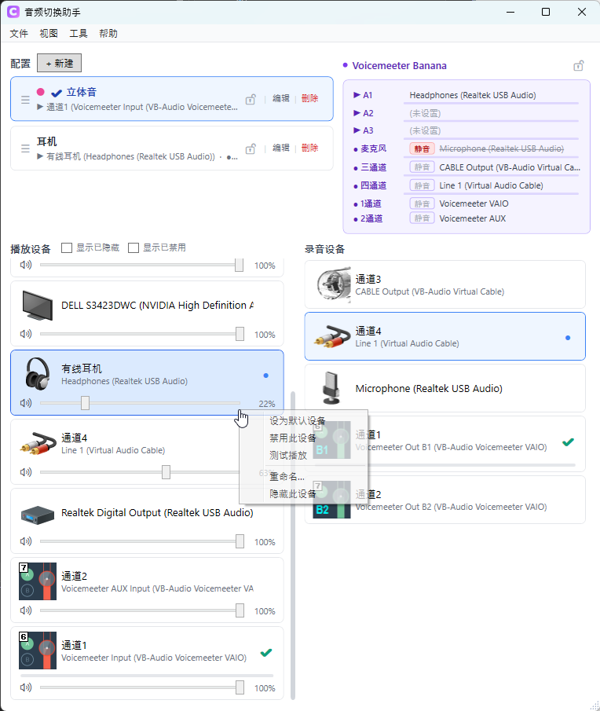

# 音频切换助手 (Audio Device Switcher)

WPF (.NET 10 for Windows) 音频设备快速切换工具。常驻系统托盘，支持配置管理、全局快捷键、应用级音频路由、蓝牙检测。

## 截图

### 主窗口


### 迷你窗口


### 托盘菜单


### 配置编辑


### 应用配置（独立预设）


### 应用级音频路由


### Voicemeeter 集成


### 设置


> 截图文件放到 `docs/screenshots/` 下对应名字即可在 README 自动显示。

## 功能

- **一键切换**：播放 / 录音设备快速切换（使用未文档化的 `IPolicyConfig` COM API）
- **配置管理**：保存常用设备组合（输出+输入+应用覆盖），带全局快捷键绑定，支持拖拽排序、标签颜色
- **导入 / 导出**：把配置 + 应用预设 + 设备别名导出为 JSON 备份，可在另一台电脑合并还原
- **配置锁定**：锁定后外部 / 内部任何设备切换都被阻止或立即恢复（≤ms 级反弹）
- **应用级路由**：按应用级覆盖默认音频设备（对应 Windows 设置里"应用音量和设备首选项"）
- **音量调节**：每个播放设备、每个应用都可调音量 / 静音；设备音量实时跟随系统及其他程序的改动（事件驱动）
- **测试播放**：右键播放设备「测试播放」，在指定设备上播放测试音
- **实时电平条**：默认播放 / 录音设备及 Voicemeeter Strip / Bus 显示横向 peak 电平
- **Voicemeeter 集成**（可选）：Strip 静音切换、设备丢失检测、静音状态锁定（默认关闭，未安装时无开销）
- **托盘常驻**：主窗口关闭只隐藏到托盘，配合迷你窗口做快速切换面板
- **迷你窗口**：无边框可拖拽、置顶、可调透明度，2 秒轮询设备状态
- **设备管理**：重命名（别名）、隐藏、启用 / 禁用、按字母排序
- **蓝牙检测**：识别并提示 BTHENUM 蓝牙音频设备
- **通知中心兼容**：使用 Windows 10/11 原生 Toast（同 Tag 自动替换，不会堆积）
- **开机自启 / 启动最小化**
- **配置安全**：配置文件原子写入 + `.bak` 自动备份，崩溃 / 断电不丢配置
- **崩溃日志**：异常写入 `%AppData%\AudioDeviceSwitcher\crash.log`

## 下载

前往 [Releases](../../releases) 页面下载最新安装包：`AudioDeviceSwitcher-Setup-x.y.z.exe`。

> Windows SmartScreen 首次运行可能拦截（应用未做代码签名），点击"更多信息 → 仍要运行"即可。

## 运行要求

- Windows 10 version 2004 (19041) 及以上
- .NET 10 Runtime（安装包自带 self-contained，不需单独装）

## 数据目录

所有配置、设置、崩溃日志存于：

```
%AppData%\AudioDeviceSwitcher
```

## 从源码构建

需要 .NET 10 SDK、Inno Setup 6（用于生成安装包）。

```bash
dotnet build                  # 编译调试版
dotnet run --project CKit     # 运行
publish.cmd                   # 打包 Release + 生成安装包到 dist/
```

## 更新日志

见 [CHANGELOG.md](CHANGELOG.md)。

## 许可

[MIT License](LICENSE)
